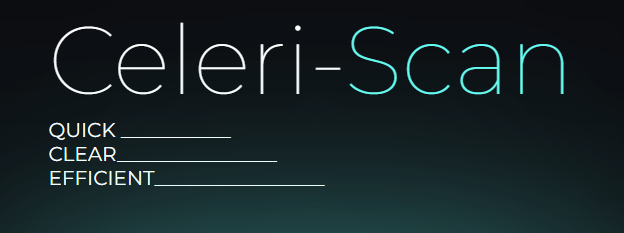
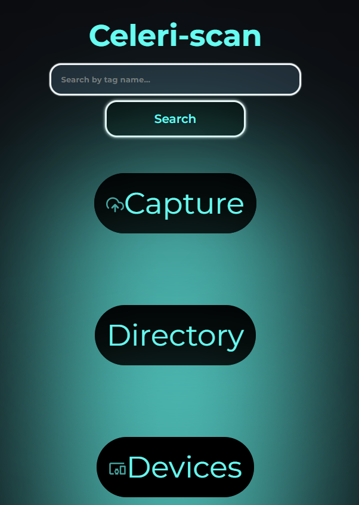
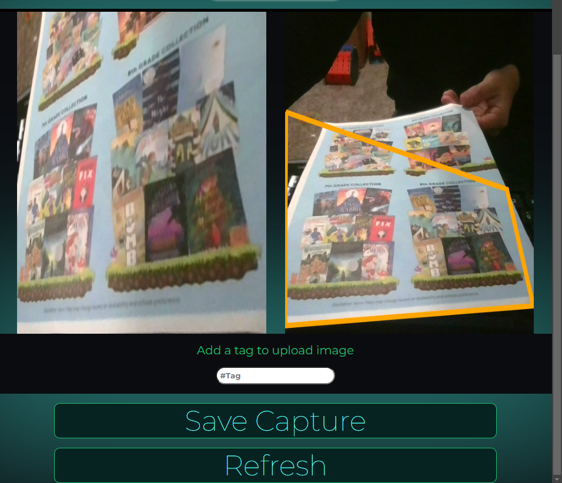

# Celeri-Scan



--------------------------------------------------------------------------------------------------------------------------------------------------------------------------------------------------


## About The Project
Celeri-Scan is a mobile document scanner app that captures images via mobile camera or desktop webcams. Built with a mobile influenced Ui and features that gaurantee user authentication and cloud based data management. Capture images and find edges to straighten a photo with the built in scanner ran off jscanify; an open source package designed by coloonel parrot
https://colonelparrot.github.io/jscanify/


## Built With

* flask
* cloudinary
* react.js
* vite
* jscanify
* opencv.js


## Getting started

1. Clone the Repository

2. Install dependencies.

   ```bash
   pipenv install -r requirements.txt

   ```
3. Create a __.env__ file based on the example with proper settings for your
   development environment.

4. Make sure the SQLite3 database connection URL is in the __.env__ file.

5. This starter organizes all tables inside the `flask_schema` schema, defined
   by the `SCHEMA` environment variable.  Replace the value for
   `SCHEMA` with a unique name, **making sure you use the snake_case
   convention.**

6. Install Cloud services
   ```bash
   pipinstall Cloudinary
   ```
   or use any cloud of your choice, then replace cloudinary files with another cloud configuration
   You can sign up for a free cloudinary account here:
   https://cloudinary.com/users/register_free

7. Place your cloudinary secret key and api key inside your env file

8. Get into your pipenv, migrate your database, seed your database, and run your
   Flask app:

   ```bash
   pipenv shell
   ```

   ```bash
   flask db upgrade
   ```

   ```bash
   flask seed all
   ```

   ```bash
   flask run

## Front End Dependencies

 cd into react-vite directory
   ```bash
   npm install
   ```

* canvas is an optional dependency if you choose to use dependencies outside of node js

## Screenshots




